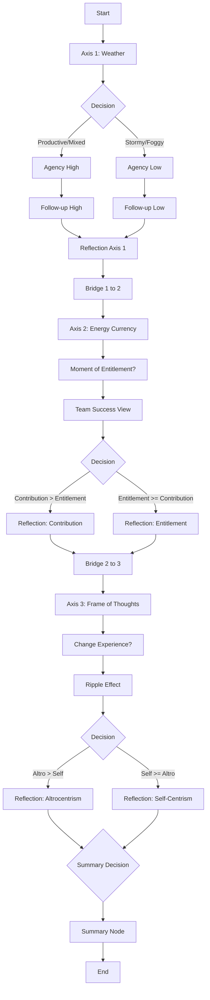
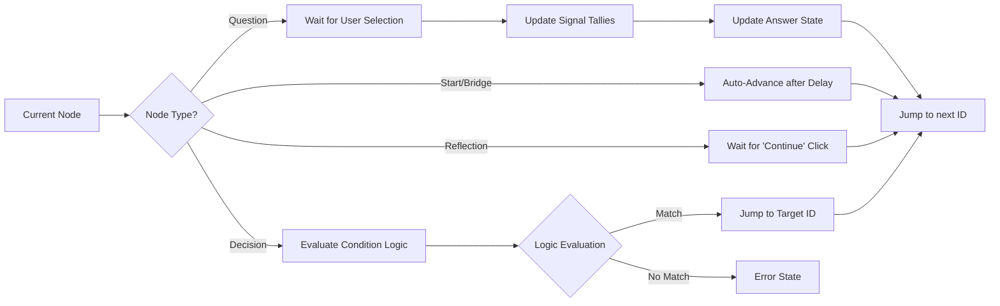
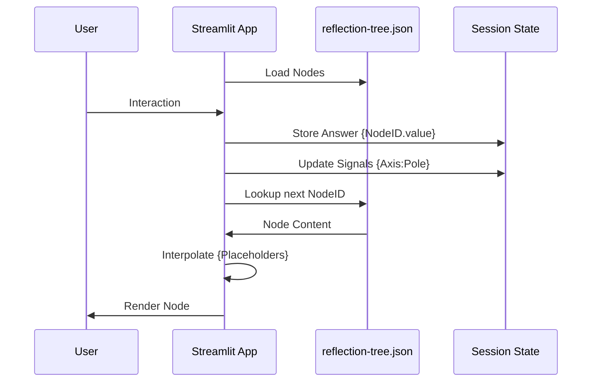

# Reflection Tree Diagram

---

## 2. Deterministic Engine Workflow
This diagram illustrates how the system processes each node without any stochastic (AI) elements.

## 3. Data Flow Architecture
How the tree data and user state interact during a session.

